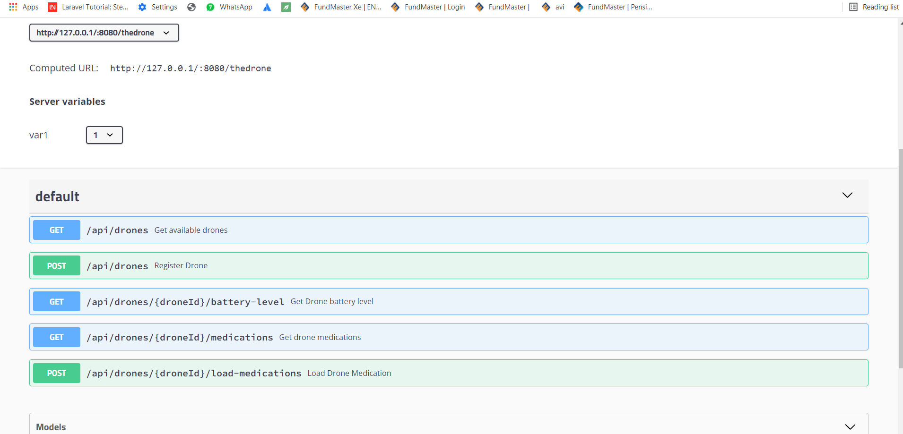
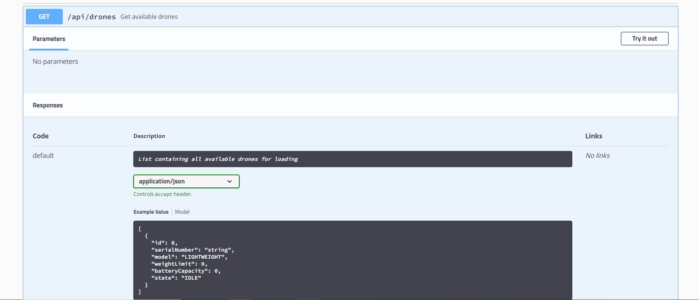
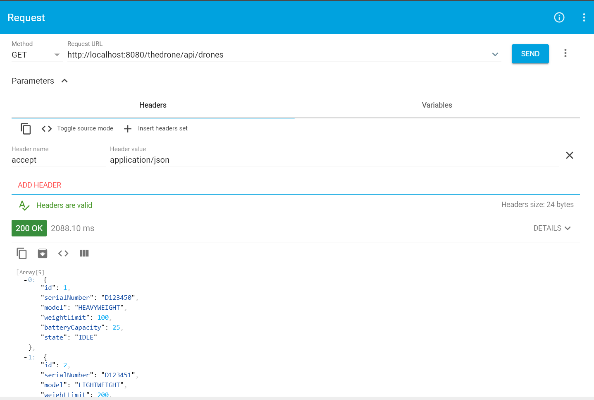
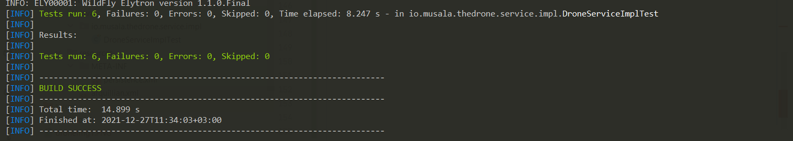

# Installation Guide

Steps on how to install,deploy and run the drone project.

To get started building this application locally you need to install the following tools (You can ignore the step if you already have installed them) :
- Maven ([Download](https://maven.apache.org/install.html/))
- Java **8**  or any above version ([Download](https://www.oracle.com/java/technologies/downloads/))
- Mysql **8.0.20** or any version. ([Download](https://dev.mysql.com/downloads/installer/))
- Wildfly **8.0.0.Final** or any above version. ([Download](https://www.wildfly.org/downloads/))


### Configure Wildfly
- Setup the application server
 - Configuration of  java in  Wildfly.
 
     - Extract downloaded wildfly to specific folder and navigate to bin folder (wildfly-18.0.0.Final\bin)
     - Next open standalone.conf.bat file in any editor like Notepad *(for linux open standalone.conf.sh)*
     - Uncomment and set JAVA_HOME  to location where your java is installed.Refer to below screenshot.
        ```xml
        
        set "JAVA_HOME=C:\Program Files\Java\jdk-11.0.7"
        set "JAVA=C:\Program Files\Java\jdk-11.0.7\bin'\java"
     - Save  and close the file.
     
 - Adding mysql-connector jar file for the respective version of mysql that you install to Wildfly.
 
    - Download and extract mysql-connector jar file ([Download](https://dev.mysql.com/downloads/connector/j/)).
    - Navigate parent directory of Wildfly  and go to (\wildfly-18.0.0.Final\modules\com\mysql\main)
    - Copy downloaded jar file to above location.
    - In the same location open or create(*if it does not exist*) module.xml file in any editor. Add your mysql connector jar file to resource root path.
        ```xml
              <module xmlns="urn:jboss:module:1.0" name="com.mysql">
                <resources>
                  <resource-root path="mysql-connector-java-8.0.20-bin.jar"/>
                </resources>
                <dependencies>
                  <module name="javax.api"/>
                </dependencies>
              </module>
    - Save  and close the file.
    
 - Configuration of Datasource.
   - Navigate parent directory of Wildfly  and go to (\wildfly-18.0.0.Fina\standalone\configuration).
   - Open standalone.xml file in any editor and scrolldown to datasources sections.
   - Add new datasource and mysql driver. Datasource name should be **java:/thedroneDS**.
       ```xml
                       <datasource jta="false" jndi-name="java:/thedroneDS" pool-name="Drone" enabled="true" use-ccm="false">
                                           <connection-url>jdbc:mysql://localhost:3306/thedrone</connection-url>
                                           <driver-class>com.mysql.jdbc.Driver</driver-class>
                                           <driver>com.mysql</driver>
                                           <security>
                                               <user-name>*****</user-name>
                                               <password>*****</password>
                                           </security>
                                           <validation>
                                               <validate-on-match>false</validate-on-match>
                                               <background-validation>false</background-validation>
                                           </validation>
                                           <statement>
                                               <share-prepared-statements>false</share-prepared-statements>
                                           </statement>
                                       </datasource>
       ```
   - **Note:** In username and password  section replace asterisks with username and password of your mysql database respectively.
   - Under drivers add new mysql driver
       ```xml
                           <driver name="com.mysql" module="com.mysql">
                               <xa-datasource-class>com.mysql.jdbc.jdbc2.optional.MysqlXADataSource</xa-datasource-class>
                           </driver>
       ```
   - Change of wildfly port.
     - By default wildfly  run in port **8080**. If the port is already in use you can always change.
     - Scrolldown to socket-binding-group section  and change port for socket binding for http and https. Note that this step is optional if the ports are not in used.
         ```xml
             <socket-binding-group name="standard-sockets" default-interface="public" port-offset="${jboss.socket.binding.port-offset:0}">
               <socket-binding name="ajp" port="${jboss.ajp.port:8009}"/>
               <socket-binding name="http" port="${jboss.http.port:8080}"/>
               <socket-binding name="https" port="${jboss.https.port:8443}"/>
               <socket-binding name="management-http" interface="management" port="${jboss.management.http.port:9990}"/>
               <socket-binding name="management-https" interface="management" port="${jboss.management.https.port:9993}"/>
               <socket-binding name="txn-recovery-environment" port="4712"/>
               <socket-binding name="txn-status-manager" port="4713"/>
               <outbound-socket-binding name="mail-smtp">
                   <remote-destination host="localhost" port="25"/>
               </outbound-socket-binding>
             </socket-binding-group>
   
   - Save and close the file.
   
 - Start the application server - wildfly.
   - Navigate parent directory of Wildfly  and go to (\Wildfly-18.0.0.Final\bin)
   - For Windows run standalone.bat file while for linux standalone.sh file.
 
   
   
 ### Create Database
- Start your Mysql database and create database called **thedrone**. You can use and any name as long as  it follows mysql naming conventions standards.
- If you choose a different name please remember to change the database name in wildfly standalone.xml file under the data source sections.
     ```xml
         <connection-url>jdbc:mysql://localhost:3306/thedrone</connection-url>
            <driver-class>com.mysql.jdbc.Driver</driver-class>
                 <driver>com.mysql</driver>
                       <security>
                          <user-name>*****</user-name>
                          <password>*****</password>
                       </security>
  
  
 ### Build and run the project
 
 - Clone the project from Github (*git clone https://github.com/wilfredkim/thedrones.git*)
 - Extract the project and navigate to parent directory of the project.
 - Make sure the application server is running.
 - Under project parent directory run the following command in the terminal.
      ```xml
         mvn clean compile  wildfly:deploy
 
 - Open browser and access the endpoints of the the drone project via following link (http://127.0.0.1:8080/thedrone/swagger-ui/)
 - **Note:**  If you are running on different port you can change port **8080** to your specified port.
 
     
     
     
     
 - You can also use other testing tools like Postman,ARC etc.
 
     
 
 ### Run test
 
 - I have used Arquillian testing framework to write my unit test.
 - Using Arquillian minimizes the burden of managing containers, deployments and  framework initializations.
 - Before you run test you need to specify the location of your application server in arquillian.xml file.
 - Open the drone project in any Java IDE and search and open arquillian.xml file.
 - Specify the location of your application server(wildfly) under configuration section (*jbossHome*).
  
      ```xml
           <configuration>
                       <property name="jbossHome">C:\Users\HP\Documents\Systech\Workspace\wildfly-18.0.0.Final</property>
                       <property name="allowConnectingToRunningServer">true</property>
                       <property name="javaVmArguments">-Xmx1024m -XX:MaxPermSize=2048m</property>
                   </configuration>
 - Save and close the file.
 - Under project parent directory run the test using the following command in the terminal.
 
    ```xml
        
        mvn test
   
 - 
   
      
 - In the source code test code  is located under test folder.
 
 
 
 
  ### End
   
 
 
 
 

 
  
 
     


